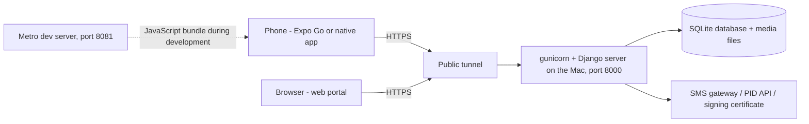

# How the Building Violation System was built, and how to run it yourself

*A plain-language walkthrough for the Additional Commissioner. Written 11 September 2026, the day the sandbox went live.
No programming background is assumed. Every command shown here can be copied into the Terminal app on the Mac as it is.*

---

## 0. What you have today

Three products and a demo server, all in one folder on your Mac (`~/Demolition Tracker Project`) and in one public code
repository (https://github.com/Yashjaluka2409/mcg-building-violations):

| Piece | What it is | Where it runs today |
|---|---|---|
| **Server** (the "brain") | Django + Django REST Framework, Python. Holds the registers, enforces the workflow and the law, signs notices, sends SMS, keeps the audit trail. | On your Mac, port 8000, behind a public tunnel |
| **Web portal** (the "office counter") | React + Vite + Tailwind. What AE / JC / Admin / branches use on a desktop. | Built into static files that the server itself serves at `/building-violations/` |
| **Mobile app** (the "field kit") | Expo / React Native. What the JE and field squads use: geotagged photos, planned inspections, delivery proof. | In Expo Go on your phone, and as native builds in the iPhone simulator and Android emulator |
| **Sandbox** | Scripts that keep all of the above running and reachable from the internet for the Commissioner's demo. | `sandbox/` folder; current links always in `sandbox/LINKS.txt` |

Demo logins: JE 9000000001 · AE 9000000002 · JC 9000000003 · JC clerk 9000000004 · XEN 9000000005 · Field squad 9000000006 ·
Addl. Commissioner 9000000007 · Admin 9000000009 · Planning 9000000011 · Revenue 9000000012 · Legal 9000000013 · GIS lab 9000000014.
The OTP for every demo login is **123456**.

---

## 1. The shape of the system (an analogy)

Think of a municipal office.

* The **database** is the register room: every case, notice, photo, appeal and status change is a row in a ledger. We use
  SQLite (a single file) for the demo and PostgreSQL (a proper server) for production - same ledgers, sturdier building.
* The **server** is the dealing hand: it receives every request ("record this inspection", "issue this notice"), checks
  who is asking and whether the law and the workflow allow it, writes to the register, and answers. It never trusts the
  form; it re-checks everything.
* The **web portal** and the **mobile app** are two counters that talk to the same dealing hand. Neither holds any data
  of its own; they ask the server for everything through a set of URLs called the **API** (documented in `docs/05`).
* The **tunnel** is a temporary gate pass: your Mac sits behind your home router, invisible to the internet, and the
  tunnel gives it a public address so a phone or the Commissioner's laptop can reach it.



**What you just learned:** a modern application is not one program but three cooperating ones; the server owns the truth,
the portal and the app are just two ways of looking at it and talking to it. That is why a rule enforced once in the
server (say, "no final order while a hold-referral is pending") applies everywhere automatically.

---

## 2. The tools, and why each one

| Tool | Role | Why this one |
|---|---|---|
| **Python 3 + Django + DRF** | Server | MCG's existing platform (built by Austere Systems) exposes a Django-style API with JWT tokens; matching it makes integration a matter of mounting our module rather than rewriting it. |
| **React 18 + Vite + Tailwind** | Portal | The same stack, colours and conventions as the MCG portal (`src/theme/mcg-tailwind-preset.js` carries the purple #782669 scale). |
| **Expo (React Native)** | Mobile | One code base for iOS and Android; Expo Go lets us test on a real phone without an App Store release. |
| **SQLite / PostgreSQL** | Database | SQLite for a zero-setup demo; PostgreSQL in production (`docs/07`). |
| **Git + GitHub** | Version history and hand-over | Every change is a commit with a message; the IT team clones the repository. |
| **Homebrew, Node.js, npm** | Installers | Homebrew installs Mac tools (Pango, JDK, Tailscale); npm installs JavaScript packages for the portal and the app. |
| **Xcode, Android SDK** | Native builds | Needed only to compile the *native* parts of the app (the anti-spoofing module); Expo Go does not need them. |
| **gunicorn, cloudflared** | Sandbox | gunicorn runs Django properly; cloudflared opens the temporary public tunnel. |

---

## 3. From your requirements to a design

The order of work mattered more than any single tool.

1. **The law first.** Every violation, notice and order in the system points at a real section: HMC Act 1994 (ss. 2, 216,
   224, 235-246, 250-267, 282-284, 315, 346, 380-393, 401-408C), Haryana Building Code 2017, HPPA 1972, PSRCA 1963, BNS 2023.
   This lives in one generator script (`shared/legal/generate_catalogue.py`) that writes two JSON files, which the server
   loads with `manage.py load_legal_catalogue`. Statutory minimums (a s.261 order needs at least 3 days; s.408A 7+7; HPPA 10;
   s.284 30) are data on each order type, and the server refuses shorter periods.
2. **The workflow as a state machine.** A case is always in exactly one state: DRAFT → PENDING_AE → PENDING_JC → SCN_ISSUED →
   SCN_SERVED → RESPONSE… → ORDER_ISSUED → ORDER_SERVED → EXECUTION_DUE → EXECUTED / COMPLIED → CLOSED, with side-tracks for
   stays, referrals, drop and regularisation. Every arrow is a function in `services/workflow.py`; each one checks the role,
   the current state and the evidence before moving.
3. **Rules as data, not code.** Which role may do what in which state (`WorkflowRule`), the routing switches (`WorkflowSetting`),
   the permissions and jurisdictions - all are rows the Admin edits in the portal, each change logged with the authorising
   order number. This is why you could raise the geofence to 50 000 m for the demo without a code release.
4. **Evidence you can defend in court.** Photos are taken inside the app with a fresh GPS fix; the server computes the distance
   to the property; notices are digitally signed PDFs with a QR code that anyone can verify; and every event is chained
   with a hash of the previous one, like each page of a register carrying the seal of the page before it (`services/audit.py`).

**What you just learned:** the most durable design decision was to make the law and the rules *data*. Code changes need a
developer and a release; data changes need an authorised officer and an order number.

---

## 4. Building the server, step by step

Open Terminal (Applications → Utilities → Terminal). Each block below is one command.

**Step 1 - go to the project and create an isolated Python environment** (think of a sealed toolbox so this project's
libraries never clash with anything else on the Mac):

```bash
cd ~/Demolition\ Tracker\ Project/backend && python3 -m venv .venv
```

**Step 2 - install the libraries the server needs** (`requirements.txt` is the shopping list):

```bash
~/Demolition\ Tracker\ Project/backend/.venv/bin/pip install -r ~/Demolition\ Tracker\ Project/backend/requirements.txt
```

The one library that needed a Mac-level dependency was WeasyPrint (bilingual PDF notices). It needs Pango, installed with
`brew install pango`.

**Step 3 - create the register tables.** Django describes each table in `models.py`; a *migration* is the recorded change
that turns those descriptions into real tables, so a fresh machine can rebuild the same database:

```bash
~/Demolition\ Tracker\ Project/backend/.venv/bin/python ~/Demolition\ Tracker\ Project/backend/manage.py migrate
```

**Step 4 - load the law and the demo data:**

```bash
~/Demolition\ Tracker\ Project/backend/.venv/bin/python ~/Demolition\ Tracker\ Project/backend/manage.py load_legal_catalogue
```

```bash
~/Demolition\ Tracker\ Project/backend/.venv/bin/python ~/Demolition\ Tracker\ Project/backend/manage.py seed_demo
```

**Step 5 - run the automated tests.** These are 40 scripted scenarios (a JE files, an AE forwards, a JC issues an SCN, a
spoofed GPS is rejected, a paper order is imported…) that the machine replays in about ten seconds. If any rule is broken by
a future change, a test fails before a citizen ever sees it:

```bash
~/Demolition\ Tracker\ Project/backend/.venv/bin/python ~/Demolition\ Tracker\ Project/backend/manage.py test building_violations
```

**Step 6 - start the server for development:**

```bash
~/Demolition\ Tracker\ Project/backend/.venv/bin/python ~/Demolition\ Tracker\ Project/backend/manage.py runserver 0.0.0.0:8000
```

Settings that change between demo and production (SMS gateway, signing certificate, database, `DEMO_MODE`, the public
address printed on notices) are read from `backend/.env`, a small text file that is deliberately kept out of GitHub.

**What you just learned:** *migrate* builds the registers, *seed* fills in demo entries, *test* replays the rulebook,
*runserver* opens the counter. Those four verbs are the whole life-cycle of a Django project.

---

## 5. Building the web portal

The portal is written once in TypeScript/React and then "built" - compressed into a handful of static files that any web
server can hand out.

```bash
cd ~/Demolition\ Tracker\ Project/web && npm install
```

During development, a live-reloading server on port 5173 forwards API calls to Django:

```bash
cd ~/Demolition\ Tracker\ Project/web && npm run dev
```

For the sandbox and production we build it and let Django serve the result (setting `SERVE_SPA=1`), so one address serves
both the API and the screens:

```bash
cd ~/Demolition\ Tracker\ Project/web && VITE_BASE_PATH=/building-violations/ npm run build
```

Pages live in `web/src/pages/` (one file per screen: dashboard, cases, notices, map, reports, admin, planned inspections,
orders before the system…), shared pieces in `web/src/components/`, and every server URL the portal calls is listed once in
`web/src/api/endpoints.ts`.

---

## 6. Building the mobile app

Expo is a toolkit around React Native. Two ideas make it click:

* **Metro** is a kitchen on your Mac (port 8081) that cooks the app's JavaScript and sends it to the phone on demand. That is
  why the phone must be able to reach the Mac (same Wi-Fi, or through a tunnel) while developing.
* **Expo Go** is a ready-made shell app from the App Store that can display any project's JavaScript. It cannot contain our
  own native code (the anti-spoofing module), which is why the production app must be a proper build (Section 11).

```bash
cd ~/Demolition\ Tracker\ Project/mobile && npm install --legacy-peer-deps
```

```bash
cd ~/Demolition\ Tracker\ Project/mobile && npx expo start --tunnel
```

Screens are in `mobile/app/` (Expo Router turns the folder structure into navigation), the camera + GPS logic in
`mobile/src/services/capture.ts`, the anti-spoofing signals in `mobile/src/services/integrity.ts`, and the offline queue in
`mobile/src/services/offline.ts`. The login screen has a small "Server … change" line so a tester can point the app at any
server address without rebuilding.

**Pitfalls we hit, and what they taught:**

* *Expo Go showed "You're signed in as yashjaluka, but not signed in to Expo CLI."* Expo Go (the phone) and the Expo command
  line (the Mac) must be signed into the same account. Because your account uses Google, the command was
  `npx expo login --browser`, which signs in through the browser.
* *The project still did not appear in Expo Go.* My start script ran Expo in "CI mode" (a setting meant for build servers),
  and in that mode Expo deliberately does not advertise the project. The lesson: read the tool's own debug log - one line
  said exactly that.
* *"Could not connect to development server" on the phone.* I had restarted the server at the very second you scanned the
  code. Timing matters; retry before diagnosing.

---

## 7. Putting it on the internet for the demo

For a demo, the Mac plays the role of the future MCG server. Four scripts in `sandbox/` do the work:

| Script | Job |
|---|---|
| `run_sandbox.sh` | Starts gunicorn (a production-grade runner for Django) on port 8000 with `DEMO_MODE=1` and `SERVE_SPA=1`. |
| `tunnel_supervisor.sh` | Opens a Cloudflare "quick tunnel" and, whenever it dies, opens a new one, writes the new address to `sandbox/PUBLIC_URL`, updates the address printed on notices and reloads the server. |
| `tunnel_watchdog.sh` | Catches the case where the tunnel dies *without* the program exiting ("Unauthorized: Tunnel not found"), which is exactly what happened at 14:35 today. |
| `expo_supervisor.sh` → `run_expo.sh` | Keeps the Metro server alive and pointed at the current public address; regenerates `LINKS.txt` and the QR codes. |

`caffeinate -dims` keeps the Mac awake; if the Mac sleeps or changes Wi-Fi, everything above has to reconnect.

**Why the address keeps changing.** A Cloudflare *quick* tunnel is anonymous and disposable: no account, no promise, and a
new random name every time it reconnects. It is fine for an hour, poor for a week. The fixes, in increasing order of
permanence:

1. **Tailscale Funnel** (free, fixed address, no warning pages). Install the Tailscale app, sign in once, run
   `sandbox/funnel.sh`; the address becomes `https://<your-mac-name>.<tailnet>.ts.net/building-violations/` and stays.
2. **ngrok with a free static domain** - `sandbox/ngrok_tunnel.sh` after creating `sandbox/ngrok.env`; fixed address, but
   browsers see a one-click warning page on first visit.
3. **The IT team's server** with the Docker files in `sandbox/` - the real answer; documented in `docs/07` and the handover note.

**What you just learned:** "it works on my laptop" and "it is available to the Commissioner" are separated by exactly one
thing - a stable public address - and anonymous tunnels do not provide one.

---

## 8. A day of debugging: how each problem was found

Every problem below was solved the same way: look at the *log* the tool writes, find the first line that names a cause, fix
that one thing, retest. None needed cleverness; all needed reading.

| Symptom | Where we looked | Cause | Fix |
|---|---|---|---|
| Expo Go could not open the project | `sandbox/expo.log` | Server pointed at a dead address; account mismatch; CI mode | Restarted with the right address; `expo login --browser`; removed `CI=1` |
| "No network" in the iPhone simulator and on the phone | `sandbox/tunnel.log` | Cloudflare had dropped the tunnel while the process lived on | Restarted the tunnel; added the watchdog; stable-address scripts |
| Android app could not reach the server from the emulator | the app's own error | The emulator started from my terminal inherits its network limits; and "localhost" inside an emulator is the emulator itself | Pointed the app at `http://10.0.2.2:8000` (the emulator's name for the Mac) |
| iOS build failed three times at script steps | `xcodebuild` logs | Three Expo scripts do not quote paths, and your folder name has spaces ("Demolition Tracker Project") | Quoted them; recommended a path without spaces |
| iOS app hung on the splash screen | Metro log: "A required entitlement isn't present" | A simulator build without an Apple developer team has no keychain access, so secure token storage fails | Development-only fallback storage; select a team in Xcode for real dev builds |
| iOS simulator would not boot | `simctl runtime list` | The freshly downloaded runtime's disk image had been purged when I removed a "duplicate" entry | Re-downloaded; noted never to delete without `--keep-asset` |

---

## 9. Anti-spoofing (GPS, VPN, fake-location apps)

The rule you asked for - *no spoofed locations, ever* - is implemented as layers, because no single check can be trusted:

1. **The phone reports signals with every fix**: mock-location provider (how FlyGPS and Fake GPS work), root/jailbreak,
   emulator, Android Developer options, VPN / proxy, iPhone "simulated by software", fix age, accuracy, jitter between two
   consecutive fixes, and whether the native module was present.
2. **The app refuses on the spot** when spoofing is unambiguous (mock provider, simulated location, root, emulator).
3. **The server decides** using the Admin's switches (Admin → Routing & guards → Location integrity), stores every check,
   and on a rejection records nothing as evidence, notifies the officer's supervisor and lists the attempt in the
   "Location Integrity" register. This includes checks the phone cannot fake: impossible travel speed between an officer's
   consecutive fixes, proxy headers, and (when configured) IP-address intelligence.
4. **Hardware attestation** (Google Play Integrity / Apple App Attest) proves the genuine, unmodified app on an untampered
   device - built in, switched on by configuration once the keys exist.

Left **off** for the demo, to switch on in production: "reject browser geotags", "require the native checks" (so Expo Go
cannot record evidence) and "require device attestation". Details: `docs/09-SECURITY-NOTES.md`.

---

## 10. Orders issued before the system

Portal → "Orders before the system". Add one paper order (original number, date, signatory, property, scan, and where the
file stands today) or upload a whole register from the CSV template. Each becomes a normal case at its real stage, with the
original order kept as a "paper order" (no re-signing) and every historical date written in. "Update status" records
service, stay, execution or closure from the file with a date and a file reference; from then on the normal machinery
applies. Register export: Reports → Legacy Orders.

---

## 11. Native builds on this Mac (what happened when you installed Xcode)

Expo Go cannot run our native anti-spoofing module, so we compiled the real app - once for iOS, once for Android.

**Generate the native projects** (they are derived from `app.json`, so they are not kept in Git):

```bash
cd ~/Demolition\ Tracker\ Project/mobile && npx expo prebuild
```

**iOS:** install CocoaPods dependencies with a UTF-8 locale, then build for the simulator:

```bash
cd ~/Demolition\ Tracker\ Project/mobile/ios && LANG=en_US.UTF-8 pod install
```

```bash
cd ~/Demolition\ Tracker\ Project/mobile/ios && xcodebuild -workspace MCGBuildingViolations.xcworkspace -scheme MCGBuildingViolations -configuration Debug -sdk iphonesimulator -destination 'generic/platform=iOS Simulator' -derivedDataPath build ARCHS=arm64 ONLY_ACTIVE_ARCH=YES CODE_SIGN_IDENTITY=- build
```

Boot a simulator, install and launch:

```bash
xcrun simctl boot "iPhone 17" ; open -a Simulator
```

```bash
xcrun simctl install booted ~/Demolition\ Tracker\ Project/mobile/ios/build/Build/Products/Debug-iphonesimulator/MCGBuildingViolations.app && xcrun simctl launch booted in.gov.mcg.buildingviolations
```

**Android:** a JDK 17 (`brew install openjdk@17`) and the Android SDK, then Gradle (it downloads the NDK by itself):

```bash
cd ~/Demolition\ Tracker\ Project/mobile/android && JAVA_HOME=/opt/homebrew/opt/openjdk@17/libexec/openjdk.jdk/Contents/Home ./gradlew :app:assembleDebug -PreactNativeArchitectures=arm64-v8a
```

```bash
~/Library/Android/sdk/emulator/emulator -avd Medium_Phone_API_36 &
```

```bash
~/Library/Android/sdk/platform-tools/adb install -r ~/Demolition\ Tracker\ Project/mobile/android/app/build/outputs/apk/debug/app-debug.apk
```

Both debug builds still fetch their JavaScript from Metro, so `npx expo start` must be running. In the Android emulator set
the server to `http://10.0.2.2:8000`; in the iPhone simulator `http://127.0.0.1:8000` also works if the tunnel is down.

The proof that the native module is inside: the Android APK contains `gov/mcg/bvms/integrity/LocationIntegrityModule` and
the Play Integrity library; the iOS binary contains 126 `LocationIntegrity` symbols; and the emulator's home screen shows
"Evidence capture blocked on this device: the app is running on an emulator".

For distribution to officers' phones the IT team uses Expo Application Services (`eas build`, profiles in `mobile/eas.json`),
which does all of the above on a build server and produces an installable APK / TestFlight build.

---

## 12. Cheat sheet: running everything yourself

| I want to… | Do this |
|---|---|
| See the current links and logins | `cat ~/Demolition\ Tracker\ Project/sandbox/LINKS.txt` |
| Start the whole sandbox after a reboot | `~/Demolition\ Tracker\ Project/sandbox/run_sandbox.sh` then `nohup ~/Demolition\ Tracker\ Project/sandbox/tunnel_supervisor.sh &` (or `sandbox/funnel.sh` for a fixed address) then `nohup ~/Demolition\ Tracker\ Project/sandbox/expo_supervisor.sh &` |
| Check that the server is up | `curl -s -o /dev/null -w "%{http_code}\n" http://127.0.0.1:8000/building-violations/api/masters/zones/` (401 means "up, login required") |
| Read the logs | `sandbox/gunicorn.log`, `sandbox/tunnel.log`, `sandbox/expo.log`, `sandbox/supervisor.log` |
| Reset the demo data | `manage.py flush --noinput && manage.py migrate && manage.py load_legal_catalogue && manage.py seed_demo` (run with the `.venv` python as in Section 4) |
| Run the tests | Section 4, step 5 |
| Rebuild the portal after a change | Section 5, last command; the server picks it up on the next reload |
| See what changed in the code | `cd ~/Demolition\ Tracker\ Project && git log --oneline` |

---

## 13. Glossary

* **API** - the list of URLs the server answers; the contract between server, portal and app.
* **Build** - turning source code into files a machine can run or serve.
* **Bundle (Metro)** - the packaged JavaScript the phone runs.
* **Commit / push** - a saved, described change in Git; sending it to GitHub.
* **Entitlement** - a permission Apple grants an app (keychain, camera…) through its signature.
* **Environment variable / `.env`** - a setting given to a program from outside its code.
* **Geofence** - a circle around a point; here, the 100 m within which a planned inspection may be started.
* **JWT** - the signed token the app carries after OTP login, proving who it is on every request.
* **Migration** - a recorded change to the database structure.
* **Tunnel** - a service that gives a machine behind a home router a public address.
* **Virtual environment (`.venv`)** - a private set of Python libraries for one project.
